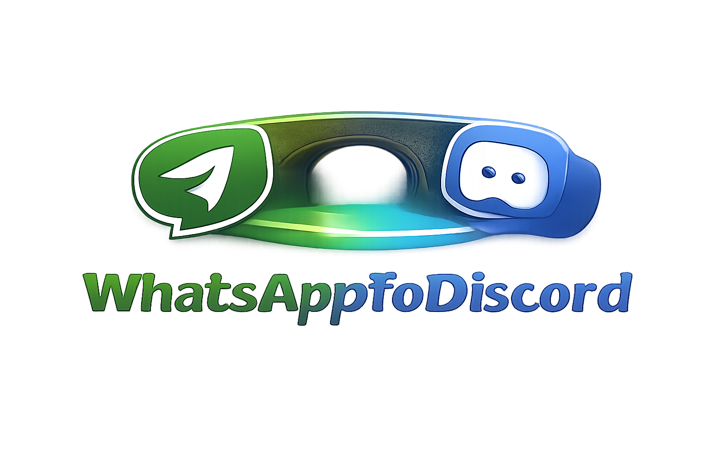

# WhatsApp To Discord

  

      

WhatsAppToDiscord (WA2DC) is a self-hosted bridge that mirrors WhatsApp chats into Discord using WhatsApp Web (via [Baileys](https://github.com/WhiskeySockets/Baileys)) and a Discord bot (via [discord.js](https://github.com/discordjs/discord.js)).

Originally created by [Fatih Kilic](https://github.com/FKLC), the project is now maintained by [arespawn](https://github.com/arespawn) with the blessing of the previous author.

> [!IMPORTANT]
> The documentation website is the best place to start (setup, commands, configuration, troubleshooting): https://arespawn.github.io/WhatsAppToDiscord/

## Requirements

- Node.js 24 or higher (or Docker)

## Highlights

- Mirrors messages, media, reactions, and edits between WhatsApp and Discord
- Lets you whitelist which chats appear in Discord
- Bridges WhatsApp polls into Discord (creation and live updates; voting stays in WhatsApp due to API limits)
- Self-hosted: runs on your own machine/server

## Security notes

- WA2DC intentionally relies on Discord permissions for access control. Keep the control channel private and restrict who can use bot commands using Discord role/channel permissions.

## Disclaimer

> [!CAUTION]
> This project is not affiliated, associated, authorized, endorsed by, or in any way officially connected with WhatsApp or any of its subsidiaries or its affiliates. The official WhatsApp website can be found at whatsapp.com. "WhatsApp" as well as related names, marks, emblems and images are registered trademarks of their respective owners.
>
> The maintainers do not in any way condone the use of this application in practices that violate the Terms of Service of WhatsApp. The maintainers of this application call upon the personal responsibility of its users to use this application in a fair way, as it is intended to be used. Use at your own discretion. Do not spam people with this. We discourage any stalkerware, bulk or automated messaging usage.
